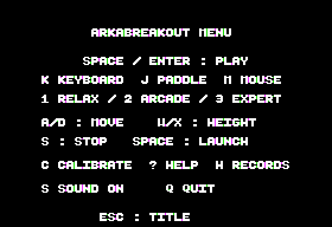
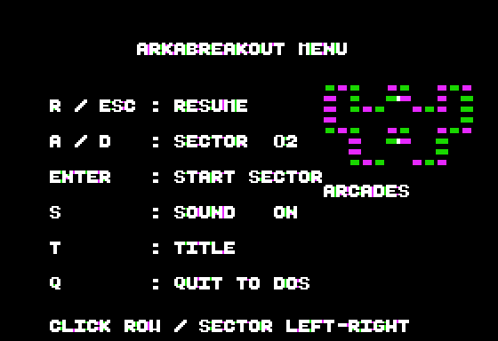
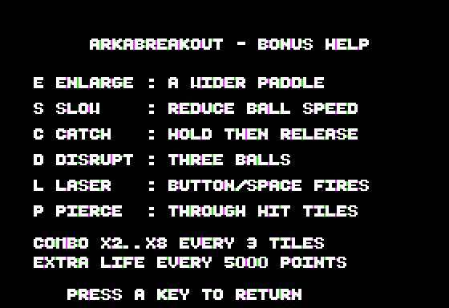

# ARKABREAKOUT

ChromaBreak's brick-breaker gameplay adapted to **Apple II+ 48 KB**, native
**HGR 280 × 192**, **NMOS 6502** and **DOS 3.3**. No language card or auxiliary
RAM is required. Boot [`ARKABREAKOUT.dsk`](../dist/ARKABREAKOUT.dsk) and play
with a joystick, Apple paddles, an **AppleMouse II slot card**, or the keyboard.


## Gameplay

- The same **60 named boards** as ChromaBreak: one-, two- and three-hit bricks,
  plus indestructible steel. Bricks have a lit top/left bevel, recessed right
  edge and lower shadow. Separated hit notches distinguish resistant bricks
  in HGR, and steel retains its hatch pattern.
- Three difficulties, selected with **1 / 2 / 3** from the ESC title menu
  (the title shortcuts remain available):

  | Mode | Lives | Paddle, HGR pixels | Start / max substeps | Speed ramp | Capsule |
  |---|---:|---:|---:|---|---|
  | Relax | 5 | 42 | 2 / 4 | Every 10 destroyed bricks | Every 4 |
  | Arcade | 3 | 35 | 3 / 6 | Every 8 destroyed bricks | Every 5 |
  | Expert | 2 | 28 | 4 / 7 | Every 6 destroyed bricks | Every 6 |

- Eight aimed rebound angles; sliding the paddle adds spin. The paddle rises
  to mid-field, stops beneath bricks and catches a descending ball while rising.
- **Combos ×1–×8**, one extra multiplier every three destroyed bricks without
  touching the paddle. Resistant hits score 10; destroyed bricks score 10 ×
  multiplier. Paddle contact or a lost life resets the combo.
- A **six-digit score**, capped at 650000; an extra life every **5000 points**,
  up to five lives. Enemies score 100 points each.
- Six capsules, cycling in order, with at most one falling:

  | Letter | Effect |
  |---|---|
  | E | Enlarge: 14 more HGR pixels, paddle centre preserved |
  | S | Slow: two substeps while active |
  | C | Catch: hold the ball at its impact point, then release |
  | D | Disrupt: three balls; losing one does not cost a life |
  | L | Laser: two visible barrels on the paddle, aligned with the shots; hold a controller button to keep firing |
  | P | Pierce: the ball becomes outlined; destroy resistant bricks in one hit and pass through them; steel still rebounds |

  A new capsule replaces the paddle mode and clears active lasers. Catch
  removes the extra balls; Disrupt clears the enemies and suspends arrivals
  while extra balls remain. A lost life or a new board resets the bonuses.
- Two white enemy silhouettes, a coil and a TIE fighter. They enter from four
  gates, turn at walls and bricks, slide through gaps and drift below the grid.
  Ball, paddle and laser contacts destroy them.
- Five **disk-backed high scores**, with three initials and difficulty; the
  furthest reached sector is kept too. `H` displays scores; `?` displays help.
- A title demo after idle time, a sector selector, sound toggle, a two-voice
  title tune, ten sector jingles and a victory fanfare on the built-in speaker.

Bonus appearance: [laser paddle](screenshots/laser.png),
[outlined Pierce ball](screenshots/pierce.png).

The graphics and geometry are adapted to native HGR: ChromaBreak's DHGR
colours, coloured sprites and patterned backgrounds are replaced by coloured
bricks and white XOR objects.

## Controls

The title centres its decorative brick bands around the logo and keeps
the sector count, play prompt, **ESC : MENU** and best
score. **ESC** opens a separate HGR page with controller choices, difficulty,
movement commands, calibration, help, records, sound and DOS exit. Escape
returns to the title. Choosing a difficulty returns to the title; choosing
K/J/M starts a game with that controller. Sound toggles in the menu and its
current ON/OFF state is shown.



**Space / Enter / mouse click** on the title starts a game with the ball launched. A detected
AppleMouse II is selected automatically; otherwise the keyboard is selected.
`K`, `J` and `M` select a controller and start from the title, or switch during play.

| Input | Action |
|---|---|
| K | Keyboard |
| J | Joystick or Apple paddles |
| M | AppleMouse II, if a card was detected |
| A / D, left / right | Continuous sideways keyboard movement |
| W / X, Ctrl-K / Ctrl-J | Continuous keyboard height movement |
| S | Stop keyboard movement |
| + / - | Keyboard horizontal speed, 1–8 pixels per update |
| Joystick X / paddle 0 | Absolute horizontal position |
| Joystick Y / paddle 1 | Absolute height; an unconnected second timer keeps the paddle on the floor |
| AppleMouse II X / Y | Absolute horizontal position / height |
| Space / either game-port button / mouse button | Release a caught ball or fire lasers |
| P | Pause / resume |
| Escape | Title: open options; during play: open the pause/sector menu |
| Ctrl-RESET | Restore DOS zero page and RESET vector; disable the mouse and return to DOS |

The original II+ keyboard reports presses, not releases: movement continues
until `S` or another direction. `C` on the title calibrates paddle 0: move fully
left and press a key, then fully right and press a key. Escape cancels; invalid
ranges fall back to the default. Calibration survives replays.

During play, the Escape menu offers **R / Escape** to resume, **A / D** or arrows to select
an already reached sector, **Space / Enter** to start it, **S** to toggle sound,
**T** for the title and **Q** to save progression and quit to DOS. The selector
shows a miniature of the selected board and its name. With AppleMouse II,
click a menu row to activate it; on the sector row, click the left half for
the previous sector or the right half for the next. A held click triggers once.
A high score
asks for three letters; Space or Enter accepts the remaining default `A`s.
On a write-protected disk the score stays in RAM and the end screen reports
that it was not saved.





## Build and test

Requirements: cc65 (`ca65`, `ld65`), Python 3; tests additionally need a C compiler
and zlib. The optional mouse integration uses a built sibling POM2 core.

```sh
make -C arkabreakout                # ../dist/ARKABREAKOUT.dsk
make -C arkabreakout run            # POM2, II+ with an AppleMouse II in slot 4
make -C arkabreakout test           # native HGR, gameplay, DOS records, 60-sector pilot
make -C arkabreakout test-mouse     # real AppleMouse II firmware on the NMOS II+
make -C arkabreakout assets         # title, sprites, board packs, music
```

`test_bricks.py` verifies title centering and the gameplay grid, bevels,
shadows and empty-cell erasure on both pages across three sector packs.

`test_title_menu.py` checks title glyph placement, ESC navigation, sound,
difficulty choices, controller starts and DOS exit.

`test_hud.py` compares the actual glyph pixels for score, lives, combo, sector
number, board name and bonus at their intended positions on both HGR pages,
including cached redraws and changing digit widths.

`test_bonus_visuals.py` checks the Pierce ball and laser barrels at every
HGR alignment, raised/edge paddles, and exact background restoration when
switching bonuses on both pages.

`test_game.py` exercises the real 6502 binary: all 60 board loads and names,
brick collisions, steel/piercing, aimed rebounds, rising paddle, difficulties,
combo, speed ramps, all six capsule spawns and effects, multiball life accounting,
laser and enemy hits, pause, both joystick axes, DOS/RESET exit and frame rates. Selector tests compare
preview pixels across packs and verify that resuming preserves the live board.
Every capsule is drawn and erased at all seven HGR alignments; both graphics
pages are compared against the original background.

`test_records.py` performs actual DOS saves, inserts and sorts six scores,
checks initials and progression after reboot, and verifies write protection.
`test_campaign.py` steers the paddle through all 60 boards in Relax mode without
changing balls, bricks, score, lives or progress. `test-mouse` runs both the
AppleWin-compatible card and the fully emulated 68705 card with their real ROMs;
it checks detection, X/Y, edge-triggered launch, laser, mouse menu clicks, held-click suppression and clean DOS exit with both `Q` and RESET. It also checks the display mode after every CPU
instruction through menu transitions, pack loads, victory, DOS saving,
records, help and the return to the title.
All disk-writing tests use private copies.

## Rendering and memory

The renderer uses **`dev/lib/hgr`**: `hgr_text8.asm`, `hgr_scanline.inc` and the
new **`hgr_xor.asm`** native rectangle/glyph kernels. Capsule and enemy sprites
are pre-shifted for seven alignments. Each HGR page retains its own objects:
erase them on the hidden page, update only changed bricks and HUD characters, draw new objects,
then flip. Once graphics are active, all screen transitions, menus and DOS
loads/saves keep full-screen HGR selected; only Q or RESET restores text.
Frames with no brick changes skip the grid scan entirely. Pixel-to-cell tables
avoid division in ball and enemy collision probes. Paused
pages converge once, then remain byte-for-byte frozen.

The delay budget depends on controller and multiball load. Measured on the
emulated 1 MHz CPU: about **37–47 updates/s** in the keyboard scenarios and
**37–38 updates/s with real AppleMouse II firmware**, including laser play
and both visible paddle barrels. The
Expert stress fixture, three balls inside the brick grid at seven substeps,
measures **43–45 updates/s with either real mouse firmware model**; an earlier
floor-paddle fixture measured 35 updates/s.
The II+ has no readable VBL; this is CPU-paced double buffering.

| Memory | Use |
|---|---|
| $1000–$127C | Brick grid, dirty flags, paddle lookup, extra balls, per-page sprite history |
| $1300–$1639 | Aligned two-voice player and tunes, loaded once from `MUSIC` |
| $1800–$1A43 | One ten-sector pack; six packs on disk, loaded between sectors |
| $1B00–$1B36 | Five records and progression |
| $1C00–$1DFF | Native pixel-to-cell collision tables |
| $1E00–$1E9F | Per-page HUD character caches |
| $2000–$5FFF | Two HGR pages |
| $6000–below $9600 | Game code/data and BSS; DOS remains resident above it |

Each board is 48 packed bytes plus a ten-byte name. The packer validates legal
cells, distinct boards/names and reachability around steel. The linker rejects
collisions with the music bank or DOS. AppleMouse firmware calls preserve the
program's zero page and slot mailboxes through `dev/lib/mouse/mouse_context.asm`.

## Credits

Code, boards and music: VERHILLE Arnaud, **GPL-3.0**, like this repository.
Beautiful Boot font: Michael Pohoreski. No arcade assets are reused.
See [TODO.md](TODO.md) for remaining hardware checks and presentation work.
