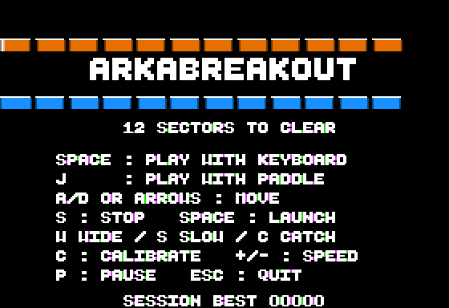
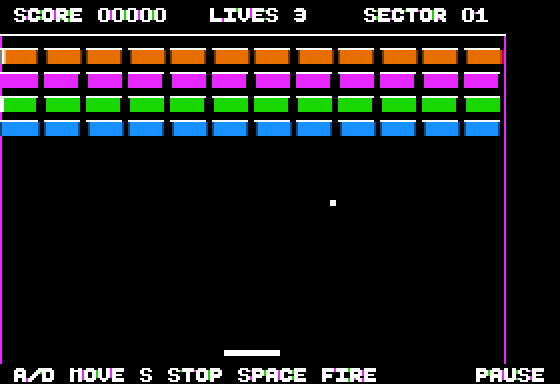

# ARKABREAKOUT

An original brick-breaker in the spirit of Arkanoid's mechanics, written in
6502 assembly for the **Apple II+ with 48 KB**, full-screen HGR 280 × 192 and
DOS 3.3. No language card, no auxiliary memory: boot the disk and play.





[Sector 09: multi-hit bricks and steel blocks](screenshots/sector-09.png)

## Features

- **12 original sectors**, three lives, five-digit score, 10 points per hit.
- Coloured bricks break in one hit; white bricks take two or three (notches
  show the hits left); hatched steel bricks are indestructible. Every brick
  has a bright top edge.
- **Aimed rebounds**: the paddle has eight symmetric impact zones, from nearly
  vertical at the centre to about 68° from vertical at the ends. The zones
  stretch with the wide paddle, and both velocity components change together
  so the ball keeps a comparable speed on every trajectory.
- **Progressive speed**: the starting speed rises every four sectors, then
  climbs after every twelve destroyed bricks, capped at five sub-steps per
  update.
- An **extra life every 1 000 points**, up to five lives in reserve.
- **Session best** shown on the title and end screens; it survives replays
  and vanishes when you quit.
- **Three capsules**, one dropping every five destroyed bricks when none is
  already falling, recognisable by their white letter:

  | Capsule | Effect |
  |---|---|
  | **W** | Wide paddle: 28 → 42 pixels |
  | **S** | Slow: speed back to two sub-steps per update, then the usual ramp |
  | **C** | Catch: the ball sticks on the next contact; space or the button relaunches it |

  A new capsule replaces the previous paddle mode. Width changes keep the
  paddle centred, within the playfield. Losing a life or clearing a sector
  resets the bonus and the starting speed. Catching a capsule also scores
  10 points.
- Keyboard or **paddle** play, with optional paddle calibration.
- Short speaker sounds with a bounded cost, so the game never stalls.

The bottom banner names the active bonus, shows **READY** while a ball waits
to be launched and **PAUSE** during a pause; its movement and launch hints
follow the control mode you chose.

## How to play

On the title screen, **space** starts a keyboard game and **J** a paddle game.
**C** calibrates the paddle: move it fully left and press a key, then fully
right and press a key. Escape cancels; an invalid range falls back to the
default setting. Calibration is kept across new games until you quit.

| Key | Action |
|---|---|
| A / left arrow | Move left continuously |
| D / right arrow | Move right continuously |
| S | Stop the paddle |
| + / - during play | Keyboard speed, 1 to 8 pixels per update |
| Space / paddle button 0 | Launch the ball |
| P | Pause / resume |
| Escape | Back to DOS |
| Ctrl-RESET | Back to DOS with the zero page restored |

The II+ keyboard reports key presses but not releases, so a movement continues
until **S** or a command in the other direction. While paused, the simulation
and both graphics pages stay frozen.

## Build and run

Requirements: [cc65](https://cc65.github.io/) (`ca65`, `ld65`) and python3.
`make test` also needs a C compiler and zlib for the emulator.

```sh
make -C arkabreakout           # ../dist/ARKABREAKOUT.dsk, bootable
make -C arkabreakout run       # boot it in POM2 (Apple II+ preset)
make -C arkabreakout test      # game checks, then the full paddle campaign
make -C arkabreakout test-campaign   # the campaign alone
make -C arkabreakout assets    # regenerate src/title.inc from the shared font
make -C arkabreakout clean     # remove build/
make -C arkabreakout distclean # also remove the disk
```

The Makefile includes [`../dev/cc65/apple2.mk`](../dev/cc65/apple2.mk), which
provides the tool variables, library paths, the DOS 3.3 disk builder and the
`run` / `clean` / `distclean` targets. The disk boots a one-line Applesoft
`HELLO` (`src/hello.bas`) that prints a banner and `BRUN ARKABREAKOUT`. From
the repository root, `make test-arkabreakout` runs the same tests.

## Tests

Both test scripts drive the real 6502 binary on an emulated 48 KB Apple II+
and never modify the original disk image.

**`tests/test_game.py`** runs the game in `a2run` and checks, through the
ld65 labels exported by `src/game.s`: start-up state, keyboard steering,
pause with both HGR pages byte-for-byte identical, wall and ceiling bounces,
brick hits and scoring, diagonal corner contacts (including a simultaneous
ceiling and side-wall impact), multi-hit and steel bricks, aimed rebounds in
all eight zones on both paddle widths (symmetric, flatter at the edges, with
a bounded velocity magnitude), the speed ramp, capsule spawning, the three
capsule effects and paddle centring on width changes, extra lives and their
cap, the session best, loading of every sector with only legal cell values,
defeat and replay, victory, paddle input, button launch and calibration,
Escape and Ctrl-RESET returning to DOS with the RESET vector intact. The hard
cases are prepared in memory during a pause, then played by the real binary.
The capsule glyphs are also checked on all seven HGR alignments: erasing them
must restore the coloured bricks exactly on both pages. The script also
measures the update rate (see below).

**`tests/test_campaign.py`** builds `tests/pilot.c` on top of a2run's 6502
core and plays a **complete campaign** with paddle steering alone: the pilot
only moves the paddle and presses space to launch; it never touches the ball,
the bricks, the lives or the score. All 12 sectors were cleared and victory
reached after 66 344 updates, about 41 minutes of emulated Apple II time.

Boot, rendering and the return to DOS were also checked with `a2shot`, which
uses the POM2 core; the pictures in `screenshots/` come from it.

Automated play does not replace hands-on sessions: balance, control comfort
and real-hardware validation are tracked in [TODO.md](TODO.md).

## Under the hood

**Toolchain.** ca65/ld65 with the shared libraries of [`../dev`](../dev/README.md):
`apple2.inc`, `hgr.asm`, `kbd.asm`, `joy.asm`, `sound.asm` and `exit.asm`
(clean return to DOS) from `dev/lib/apple2`, `hgr_text8.asm` and
`hgr_scanline.inc` from `dev/lib/hgr`, the Beautiful Boot font from
`dev/lib/font`, and the `apple2_hgr.cfg` linker script from `dev/cc65`.
Routines are assembled only when referenced, so the game pays only for what
it uses.

**Memory map.** The program is loaded at `$6000` and the binary measures
**7 670 bytes**, well under the 13 824-byte limit of the `$6000-$95FF`
region below DOS. The two HGR pages are reserved at `$2000-$5FFF`. The brick
grid, its two per-page change lists and the paddle lookup table take 544
bytes in `$1000-$1FFF`. DOS and the `HELLO` program are preserved.

**Playfield.** 12 × 8 cells of 21 × 12 pixels, each brick showing a 18 × 8
pixel surface with gaps between bricks. Ball positions carry an 8-bit fraction
on both axes; each sub-step moves at most one pixel per axis. Collisions test
the ball's four corners and resolve the two axes separately. The engine is
independent of the displayed colours.

**Rendering.** Each HGR page remembers the positions of the objects it shows.
On the hidden page the engine first erases the old sprites by XOR, applies the
changed bricks, then draws the new sprites. Capsules use white glyphs
pre-shifted for the seven HGR alignments. Normal-size text stays white. The
banner is redrawn only when it changes.

**Title and font.** The ×2 title is precomputed from the shared font by
`tools/generate_title.py`, which reads `dev/lib/font` through
`../dev/tools/fonts.py` and writes `src/title.inc` (16 scanlines of 24 bytes);
`make assets` regenerates it.

**Pacing.** The II+ has no readable VBL, so a CPU delay is added to the
simulation and drawing work. The tests measure about **32 updates per second
on the keyboard with the ball at rest** and about **29 updates per second
during play, keyboard or paddle**, on the emulated 1 MHz CPU. A shorter wait
in paddle mode compensates for the cost of reading its timers. The rate varies
with collisions, sounds and banner updates; page flips are not synchronised
with the video beam.

## Credits and licence

Code and boards: VERHILLE Arnaud, **GPL-3.0**, like the whole repository.
Beautiful Boot font: Michael Pohoreski. No graphics, level or sound from the
arcade game is reused.

Part of [pom2games](../README.md); shared libraries and tools are described in
[`dev/README.md`](../dev/README.md).
