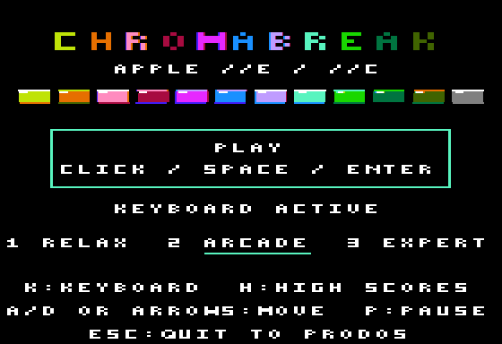
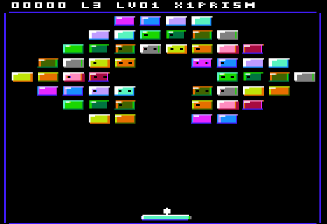
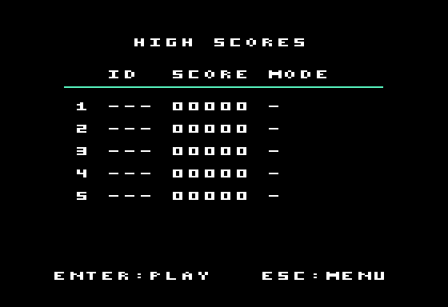
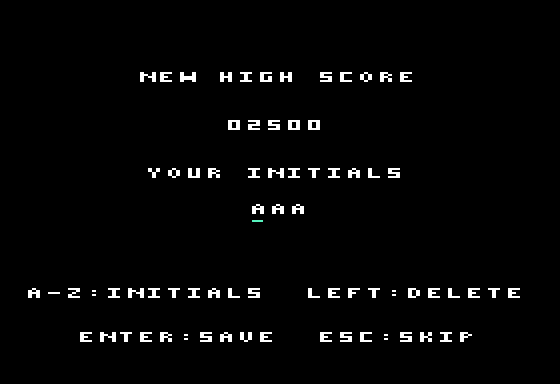
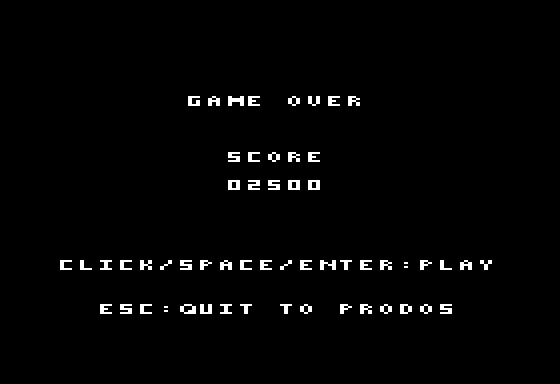

# ChromaBreak

Casse-briques pour **Apple //e enhanced 128 Ko sous ProDOS**, en DHGR
560 × 192 / 16 couleurs, avec AppleMouse II et clavier, également compatible Apple //c 128 Ko et sa
souris intégrée. Les collisions
utilisent les 140 colonnes de couleur du DHGR. Disquette amorçable :
[`CHROMABREAK.po`](../dist/CHROMABREAK.po), ProDOS 8 2.4.3, 140 Ko.

Ce profil est distinct de [`arkabreakout`](../arkabreakout/README.md), destiné
à l'Apple II+ 48 Ko sous DOS 3.3, en HGR avec clavier/paddle.

## Jouer

    make -C chromabreak
    make -C chromabreak run      # //e enhanced + AppleMouse
    make -C chromabreak run-iic  # //c + souris intégrée native

Le lancement utilise `--preset iie --slot 4=mouseaw` dans POM2 pour sélectionner
le //e enhanced et brancher explicitement sa carte souris. `mouse` fonctionne
également. Dans POM2, placer le pointeur sur l'écran Apple II ; la capture
relative se bascule avec Ctrl+Alt+G et se libère aussi avec le clic central.
Sur une machine réelle : //e enhanced, carte 80 colonnes étendue 64 Ko
auxiliaires, DHGR activé et carte AppleMouse II en slot libre. Sur //c, les interruptions ROM de la souris intégrée restent
actives ; le rendu masque seulement les accès brefs aux banques vidéo.

| Commande | Action |
|---|---|
| Clic, Espace ou Entrée au menu | Jouer et lancer immédiatement la balle |
| `1` / `2` / `3` au menu | Relax / Arcade / Expert |
| `H` au menu | Afficher les cinq records ; Échap revient au menu |
| Déplacement horizontal de la souris | Positionner la raquette |
| Clic, Espace ou Entrée pendant la partie | Relancer une balle attachée ; tirer avec le bonus laser |
| `M` / `K` | Choisir souris / clavier ; `K` démarre aussi au menu |
| `A` / `D`, flèches gauche / droite | Déplacement au clavier |
| `S` | Arrêter le déplacement au clavier |
| `P` | Pause / reprise |
| Échap ou Ctrl-RESET | Retour propre à ProDOS |

Sans carte souris, le clavier fonctionne immédiatement. Un clic maintenu ne
provoque pas de lancements répétés. Démarrer avec Espace ou Entrée conserve la souris.
La page de garde propose une action principale « PLAY » ; `K` démarre
directement au clavier. Un seul geste suffit pour commencer la partie.
Le cadre de lancement regroupe « PLAY » et « CLICK / SPACE / ENTER ».
Les trois difficultés sont réunies sur une ligne, avec un trait cyan sous
la sélection. Les commandes clavier, les records et la sortie occupent
les lignes du bas. Les textes sont centrés avec l’avance réelle de cinq
colonnes de la petite police.

Les écrans de fin de partie et de saisie des initiales suivent le même
alignement. La table des records sépare le rang, les initiales, le score
et le nom complet du mode ; une entrée vide affiche un tiret.

## Jeu et rendu

Douze tableaux propres à ChromaBreak : PRISM, ARCADES, CHEVRONS, PORTALS,
SPIRAL, DIAMONDS, CASCADE, GALAXY, CIRCUITS, BASTION, MAZE et SUPERNOVA.
Les motifs ménagent des passages et des zones de rebond, avec des briques
simples, résistantes à deux ou trois coups et de l’acier indestructible.

| Mode | Vies | Largeur de raquette | Vitesse initiale / maximum | Accélération | Capsule |
|---|---:|---:|---:|---|---|
| Relax | 5 | 26 | 2 / 4 | Tous les 10 blocs | Tous les 4 blocs |
| Arcade | 3 | 22 | 3 / 6 | Tous les 8 blocs | Tous les 5 blocs |
| Expert | 2 | 18 | 4 / 7 | Tous les 6 blocs | Tous les 6 blocs |

Largeurs en pixels de couleur DHGR ; vitesses en sous-pas par image.
Le clavier avance de quatre colonnes par image. Le point d’impact sur la
raquette choisit huit angles. Une vie supplémentaire est accordée tous les
1 000 points, jusqu’à cinq vies.

Les destructions successives augmentent le multiplicateur tous les trois
blocs, jusqu’à ×8. Un contact avec la raquette ou une perte de vie le remet à
×1. Un impact sur une brique résistante rapporte 10 points ; sa destruction
rapporte 10 fois le multiplicateur affiché.

Une capsule peut tomber : raquette large, ralentissement
ou capture de la balle sur la raquette, multiballe, laser et balle traversante.

| Capsule | Effet |
|---|---|
| Orange | Raquette élargie de huit pixels de couleur |
| Rose | Ralentissement à deux sous-pas par image |
| Rouge | Capture de la balle au prochain rebond |
| Violet | Trois balles qui partent en éventail |
| Cyan sombre | Deux lasers ; maintenir le clic permet de répéter les tirs |
| Lavande | Balle traversante qui détruit les briques résistantes en un coup |

Une vie n’est perdue que lorsque la dernière balle tombe. Les lasers enlèvent
un point de résistance et sont absorbés par l’acier ; la balle traversante
rebondit aussi sur l’acier. Les balles restent blanches. Les balles supplémentaires
restent en jeu lorsqu’un autre bonus est ramassé, sauf avec la capture.

Les briques résistantes brillent brièvement à l’impact ; une destruction
produit deux éclats de leur couleur, avec au maximum quatre éclats simultanés.
Ils disparaissent sans laisser de traces sur les deux pages vidéo.

Une nouvelle vie ou un tableau remet
les bonus à zéro. Les bonus restent actifs jusqu'à cette remise à zéro ou
jusqu'au ramassage d'une autre capsule.

Briques à 12 teintes alternées avec reflets et ombres, bordures bleu sombre,
raquette cyan avec reflet blanc, ombre bleue et extrémités arrondies argentées,
et balle blanche arrondie de 3 × 6 pixels de
couleur. Le titre est multicolore ; le fond de jeu reste noir et uni.
Tous les textes affichés dans le jeu sont en anglais, y compris les menus,
les noms des tableaux, les difficultés et la sauvegarde des records.

Le bandeau supérieur occupe cinq lignes de pixels et regroupe le score,
les vies, le niveau, le multiplicateur et le nom du tableau ou du bonus.
Les commandes détaillées restent au menu. L’aire de jeu s’étend de la ligne
11 à la ligne 190, soit 180 lignes contre 160 précédemment (+12,5 %).
Les briques commencent à la ligne 14 ; la raquette se trouve à la ligne 184.
Ces coordonnées, le rendu et les tables de collision partagent `src/layout.h`.

Le haut-parleur Apple II joue des sons distincts pour le lancement, les
rebonds, l’acier, les impacts et destructions, les bonus, les tableaux et
la perte d’une vie. Les effets se répartissent sur plusieurs images ; les
interruptions de la souris restent actives. La pause coupe les sons.

Deux pages DHGR en RAM principale et auxiliaire. Les sprites et le texte
utilisent un moteur assembleur avec tables de scanlines et de phases. La
boucle de dessin des sprites est copiée à la même adresse dans les deux
banques mémoire ; ses paramètres et masques restent en page zéro. Les
arrière-plans sont sauvegardés séparément par page et restaurés dans l'ordre
inverse. Le contenu souhaité du score est préparé une seule fois pour les deux
pages, chacune conservant son historique des caractères affichés. Le score
ne redessine que ses caractères modifiés, un par image, et une
raquette efface seulement les bandes qu’elle découvre lorsqu’elle bouge. Ses
sept alignements DHGR sont mis en cache et réutilisés, avec des couleurs
constantes. Les collisions réutilisent les zones vides pendant le déplacement d’une
balle ; le cache est réinitialisé pour chaque balle et à chaque image.
Les impacts changent seulement les
encoches d’une brique ou effacent sa surface. La petite police de la bibliothèque `dhgr_puts_small` dessine des glyphes
4×5 pixels couleur, avec une avance de cinq colonnes et des masques qui
préservent les voisins aux sept alignements DHGR. La préparation du bandeau
et le dessin d’un caractère se font sur des images distinctes.

La présentation attend deux rafraîchissements vidéo : **30 images/s NTSC
et 25 images/s PAL**, avec des intervalles réguliers dans les tests de jeu
ordinaire et dans le scénario à dix objets simultanés (trois balles, deux
tirs, une capsule et quatre éclats), avec la raquette en mouvement à vitesse
Expert. Le //e suit le retour vertical pendant le rendu ; le
//c utilise le mode VBL de sa souris et un gestionnaire ProDOS, libéré à
Échap ou RESET. Le nouveau tableau est construit sur la page cachée, affiché
complet une seule fois puis copié sur l’autre page, avec les fonds des sprites.
Les attentes ont un repli borné si la synchronisation disparaît.

Références : [interruptions ProDOS](https://prodos8.com/docs/techref/adding-routines-to-prodos/)
et [note technique Apple IIc sur le VBL](https://mirrors.apple2.org.za/Apple%20II%20Documentation%20Project/Computers/Apple%20II/Apple%20IIc/Documentation/Apple%20IIc%20Technical%20Notes.pdf).

Les cinq meilleurs scores sont conservés dans `HIGHSCORES`, avec trois
initiales et le mode joué. À la fin d’une partie qualifiée, saisir A–Z,
corriger avec la flèche gauche puis valider avec Entrée. Échap permet de
passer la saisie. Un fichier absent est créé à la sauvegarde ; un fichier
corrompu donne une table vide. Si le disque est protégé ou indisponible,
« SAVE FAILED » apparaît et le record reste consultable en mémoire.

Le disque démarre sur le petit chargeur `CHROMA.SYSTEM`, qui charge le jeu
`CHROMA.SYS`. Celui-ci reloge le binaire à `$6000`.
Les tables de la petite police, dans une zone de 2 Ko, sont copiées à `$0800`, les buffers de fichiers à `$1000`
et les fonds des sprites conservés en RAM principale sous `$2000`.
Le runtime ProDOS restaure le texte, la souris, la page zéro, le vecteur RESET
et le bitmap système à la sortie, puis appelle `QUIT`. Le jeu utilise la RAM
auxiliaire directement, sans vérifier `/RAM` et sans dialogue. À la sortie,
le disque RAM ProDOS est recréé vide.

## Validation

    make -C chromabreak test
    make -C chromabreak test-mouse POM2_SRC=/chemin/vers/pom2
    make -C chromabreak test-records POM2_SRC=/chemin/vers/pom2

Le premier vérifie le format ProDOS et le contenu du disque, puis, si a2shot
est disponible sous macOS arm64, le démarrage réel sur //e, la cadence, le
lancement direct par Espace/Entrée/K, le clavier, la pause, les 12 transitions, la victoire, la reprise et Échap/RESET.

Le test des records vérifie les écritures ProDOS et le rechargement des cinq
entrées, leur tri, les initiales et difficultés, les fichiers absents/corrompus
et le disque protégé. Il compare aussi 328 640 collisions au modèle de la
balle ronde et vérifie les 65 536 conversions du score.

Le second test optionnel nécessite un POM2 compilé (`libpom2_core_test.a`) et
ses ROMs Apple. Il exécute le firmware réel avec les deux cartes `mouse` et
`mouseaw`, vérifie clic/Espace, axes X/Y, pause, huit rebonds, briques, bonus,
restauration des fonds, raquettes unies et silhouette ronde blanche dans
les sept phases DHGR, sons de lancement et silence en pause,
Échap/RESET et la remise en état de `/RAM`, puis répète les scénarios avec la souris intégrée native et
les ROMs //c de 16 et 32 Ko, ainsi que les cadences PAL du //e et du //c.
Il vérifie les intervalles entre images pendant les déplacements à la souris, les traits droits de la police et
les transitions depuis les deux pages : aucune écriture sur la page affichée. Les scénarios de collision injectent
l'état initial des cas de test. Ils ne constituent pas une campagne jouée
de bout en bout sans intervention. Les images testées sont des copies temporaires.

Bibliothèques communes : [`dev/lib/prodos`](../dev/lib/prodos/README.md),
[`dev/lib/mouse`](../dev/lib/mouse/README.md), DHGR dans `dev/lib/hgrc` et
construction des volumes dans [`dev/tools/prodos`](../dev/tools/prodos/README.md).
Code et tableaux : VERHILLE Arnaud, GPL-3.0. Le système ProDOS conserve ses
crédits et droits propres.
