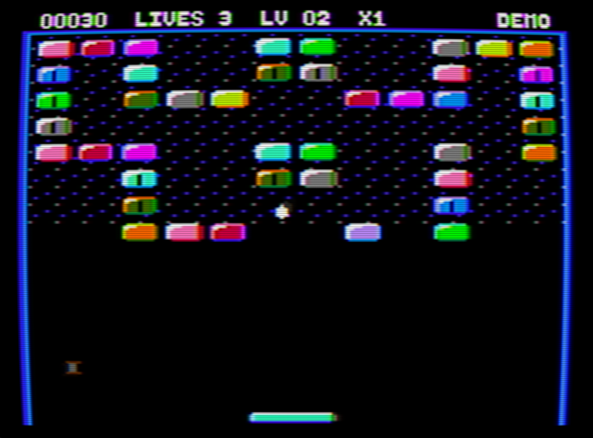
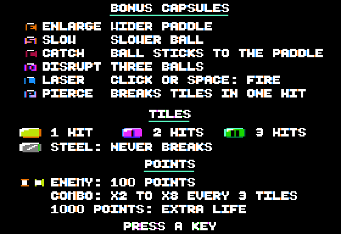
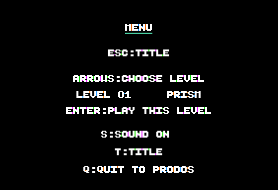

# ChromaBreak

Version 1.0 : [disquette et notes de publication](https://github.com/habib256/pom2games/releases/tag/chromabreak-1.0).

Casse-briques pour **Apple //e enhanced 128 Ko sous ProDOS**, en DHGR
560 × 192 / 16 couleurs, avec AppleMouse II et clavier, également compatible Apple //c 128 Ko et sa
souris intégrée. Les collisions
utilisent les 140 colonnes de couleur du DHGR. Disquette amorçable :
[`CHROMABREAK.po`](../dist/CHROMABREAK.po), ProDOS 8 2.4.3, 140 Ko.

Ce profil est distinct de [`arkabreakout`](../arkabreakout/README.md), destiné
à l'Apple II+ 48 Ko sous DOS 3.3, en HGR avec clavier/paddle.

## Jouer

    make -C chromabreak
    make -C chromabreak run      # //e enhanced + AppleMouse
    make -C chromabreak run-iic  # //c + souris intégrée native

Le lancement utilise `--preset iie --slot 4=mouseaw` dans POM2 pour sélectionner
le //e enhanced et brancher explicitement sa carte souris. `mouse` fonctionne
également. Dans POM2, placer le pointeur sur l'écran Apple II ; la capture
relative se bascule avec Ctrl+Alt+G et se libère aussi avec le clic central.
Sur une machine réelle : //e enhanced, carte 80 colonnes étendue 64 Ko
auxiliaires, DHGR activé et carte AppleMouse II en slot libre. Sur //c, les interruptions ROM de la souris intégrée restent
actives ; le rendu masque seulement les accès brefs aux banques vidéo.
Le jeu est écrit pour le 65C02. Sur un //e d’origine (non enhanced, 6502),
le chargeur `CHROMA.SYSTEM` le détecte avant tout : il affiche « CHROMABREAK
NEEDS A 65C02 CPU » puis rend la main à ProDOS sur une touche (testé dans
POM2 avec la ROM `apple2e_unenh` et un 6502 NMOS). Un //e d’origine équipé
d’un 65C02 passe ce test ; sans la ROM enhanced, il n’a pas été essayé.

| Commande | Action |
|---|---|
| Clic, Espace ou Entrée au menu | Jouer et lancer immédiatement la balle |
| `1` / `2` / `3` au menu | Relax / Arcade / Expert |
| `H` au menu | Afficher les cinq records ; Échap revient au menu |
| `?` au menu | Page d’aide : capsules, tuiles et points ; une touche ou un clic revient |
| Déplacement horizontal de la souris | Positionner la raquette |
| Déplacement vertical de la souris | Monter / descendre la raquette (relatif) |
| Clic, Espace ou Entrée pendant la partie | Relancer une balle attachée ; tirer avec le bonus laser |
| `M` / `K` / `J` | Choisir souris / clavier / joystick ou paddles ; `K` et `J` démarrent aussi au menu |
| Joystick X ou paddle 0 | Position horizontale de la raquette (absolue) |
| Joystick Y ou paddle 1 | Hauteur de la raquette (absolue) |
| Bouton 0 ou 1 (ou Pomme) | Comme le clic : relancer la balle, tirer au laser |
| `A` / `D`, flèches gauche / droite | Déplacement horizontal au clavier |
| `W` / `X`, flèches haut / bas | Déplacement vertical au clavier |
| `S` | Arrêter le déplacement au clavier |
| `P` | Pause / reprise |
| Échap | Menu (voir ci-dessous) ; `Q` y quitte proprement vers ProDOS |
| Ctrl-RESET | Retour propre à ProDOS |

**Menu Échap** (en jeu, sur la page de garde ou les écrans de fin) : Échap ou
`R` reprend la partie telle quelle (ou revient à la page de garde), les flèches
ou `A`/`D` choisissent un tableau déjà atteint (affiché avec son nom ; depuis la
page de garde, le menu s’ouvre sur le plus lointain), et Entrée ou Espace
lance une partie sur ce tableau. `S` coupe ou rétablit le son,
`T` revient à la page de garde et `Q` quitte vers ProDOS.

À l’arrivée sur la page de garde, un thème joue à **deux voix** (environ 5 s :
la suite d’accords I-vi-IV-V en arpèges montants sur une basse fondamentale /
quinte, puis une petite phrase qui conclut pendant que la basse monte vers la
dominante) ; une touche l’interrompt aussitôt, et il ne rejoue pas après la
démo, après l’aide ni quand le son est coupé. Thème et airs de fin de tableau sont rangés en
RAM auxiliaire après la police (voir « Musique à deux voix »). La page de
garde porte la version et la signature
« V1.0  BY ARNAUD VERHILLE » ; le sous-titre rappelle « APPLE //C AND //E
128K 65C02 ».

Après 15 s sans touche, clic ni mouvement de souris sur la page de garde, un
**mode démo** joue seul, en silence et sans enregistrer de record : le pilote
suit la balle avec un décalage variable, la relance et tire au laser. Le bandeau
affiche « DEMO » et chaque démo prend le tableau suivant. Une touche ou un clic,
une balle perdue ou 60 s ramènent à la page de garde. Le délai est mesuré en
rafraîchissements vidéo ; la fréquence 50/60 Hz est détectée au démarrage, si
bien qu'il vaut 15 s en NTSC comme en PAL.

Sans carte souris, le clavier fonctionne immédiatement. Un clic maintenu ne
provoque pas de lancements répétés. Démarrer avec Espace ou Entrée conserve la souris.
La page de garde propose une action principale « PLAY » ; `K` démarre
directement au clavier. Un seul geste suffit pour commencer la partie.
Le cadre de lancement regroupe « PLAY » et « CLICK / SPACE / ENTER ».
Les trois difficultés sont réunies sur une ligne, avec un trait cyan sous
la sélection ; `1`, `2` ou `3` ne redessinent que ce trait. Les commandes clavier, les records et la sortie occupent
les lignes du bas. Les textes sont centrés sur les 40 cellules de la police
Beautiful Boot (voir « Jeu et rendu »).

Les écrans de fin de partie et de saisie des initiales suivent le même
alignement. La table des records sépare le rang, les initiales, le score
et le nom complet du mode ; une entrée vide affiche un tiret.

## Jeu et rendu

Soixante tableaux propres à ChromaBreak, de PRISM à OMEGA : motifs
géométriques, figures (INVADERS, HEART, GHOST, MUSHROOM, ROCKET, APPLE,
SKULL, CASTLE, PACMAN, ROBOT…), labyrinthes et forteresses, avec des briques
simples, résistantes à deux ou trois coups et davantage d’acier au fil des
niveaux. Ils sont dessinés en art ASCII dans `src/levels.txt` (`.` vide,
`1`-`3` résistance, `#` acier) ; `tools/pack_levels.py` vérifie que chaque
brique reste accessible par le bas, que les tableaux et noms sont distincts,
et range la banque (deux briques par octet, puis les noms) que `CHROMA.SYS`
copie en RAM auxiliaire à `$0A00`. Le jeu en recopie un seul tableau et son
nom à chaque début de niveau (`level_fetch`).

| Mode | Vies | Largeur de raquette | Vitesse initiale / maximum | Accélération | Capsule |
|---|---:|---:|---:|---|---|
| Relax | 5 | 26 | 2 / 4 | Tous les 10 blocs | Tous les 4 blocs |
| Arcade | 3 | 22 | 3 / 6 | Tous les 8 blocs | Tous les 5 blocs |
| Expert | 2 | 18 | 4 / 7 | Tous les 6 blocs | Tous les 6 blocs |

Largeurs en pixels de couleur DHGR ; vitesses en sous-pas par image.
Le clavier avance de quatre colonnes ou trois lignes par image. Le point
d’impact sur la raquette choisit huit angles. Une vie supplémentaire est
accordée tous les 1 000 points, jusqu’à cinq vies.

La raquette monte jusqu’à mi-terrain (ligne 100) et ne traverse jamais les
briques : sous une brique de la dernière rangée, elle s’arrête six lignes
plus bas (ligne 112, la place de la balle attachée) ; à hauteur de cette
rangée, elle bute contre la première brique sur son chemin, même lors d’un
grand déplacement de souris. Une raquette qui glisse sous une balle déjà
basse, ou qui monte vers elle, la renvoie aussi : le contact balle/raquette
est vérifié à chaque image, avant les sous-pas de la balle.

Le mouvement de la raquette donne de l’effet au rebond : un glissement
latéral entraîne l’angle dans son sens (d’une zone, de deux à partir de huit
pixels par image) ; une raquette qui monte redresse le rebond, une raquette
qui descend l’aplatit.

Les destructions successives augmentent le multiplicateur tous les trois
blocs, jusqu’à ×8. Un contact avec la raquette ou une perte de vie le remet à
×1. Un impact sur une brique résistante rapporte 10 points ; sa destruction
rapporte 10 fois le multiplicateur affiché.

Une capsule peut tomber : un petit bloc coloré de 5 × 6 pixels, au sommet
blanc, marqué d’une lettre noire à la manière d’Arkanoid. Le bandeau affiche
le nom du bonus actif.

| Capsule | Bandeau | Effet |
|---|---|---|
| **E** orange | ENLARGE | Raquette élargie de huit pixels de couleur |
| **S** rose | SLOW | Ralentissement à deux sous-pas par image |
| **C** rouge | CATCH | La balle reste collée à l’endroit où elle touche la raquette |
| **D** violet | DISRUPT | Trois balles qui partent en éventail |
| **L** bleu | LASER | Deux canons rouges sur la raquette, deux lasers ; maintenir le clic répète les tirs |
| **P** bleu clair | PIERCE | Balles rouges et plus grosses (4 × 7), qui détruisent les briques résistantes en un coup |

Avec le laser, chaque extrémité de la raquette porte un canon rouge de 1 × 3
pixels, d’où part le tir (le canon et son tir partagent un sprite) ; les tirs
de 1 × 4 ont une tête blanche sur un corps jaune. Avec la balle traversante,
les balles deviennent des sphères ombrées de 4 × 7 pixels (bord gauche rose,
cœur rouge, bord droit violet, pointes centrées), dessinées une ligne plus
haut ; leur silhouette de collision reste celle de 3 × 6. Leurs couleurs par
pixel tiennent compte du décalage d’un point entre fenêtre de pixel et
cellule couleur (`tools/generate_sprite_tables.py`).

Une vie n’est perdue que lorsque la dernière balle tombe. Les lasers enlèvent
un point de résistance et sont absorbés par l’acier ; la balle traversante
rebondit aussi sur l’acier. Les balles restent blanches. Les balles supplémentaires
restent en jeu lorsqu’un autre bonus est ramassé, sauf avec la capture.

Les briques résistantes brillent brièvement à l’impact ; une destruction
produit deux éclats de leur couleur, avec au maximum quatre éclats simultanés.
Ils disparaissent sans laisser de traces sur les deux pages vidéo.

Des ennemis arrivent régulièrement (toutes les 6 s en Relax, 4,5 s en Arcade,
3 s en Expert, deux au plus) par deux portes en haut du terrain ou par les
côtés juste sous les briques. Tous deux mesurent 4 × 6 pixels, aux couleurs
changeantes, pour ne jamais les confondre avec une balle. Le premier est une
bobine : barres haute et basse autour d’un noyau blanc étroit (style 6). Le
second est un chasseur « TIE » : deux ailes verticales colorées encadrant un
noyau blanc, ouvert en haut et en bas (style 14, ailes calculées depuis les
masques ronds). Ils ne traversent pas les briques : bloqués vers le bas, ils
glissent le long des briques jusqu’à trouver un passage. Sous la grille, la
bobine erre (nouveau cap toutes les 16 images) tandis que le TIE ondule en
vagues (20 points vers le bas, 12 vers le haut toutes les 32 images) ; tous
deux finissent par sortir par le bas. Une balle (qui rebondit), un laser ou la
raquette les détruit pour 100 points, avec deux éclats. Une perte de vie ou
un nouveau tableau les efface. Pour tenir la cadence, aucun ennemi n’arrive
pendant la multiballe et la capsule D fait exploser ceux qui sont présents.

Un tableau terminé affiche « SECTOR nn CLEAR » au centre, sur la page
cachée présentée d’un coup, avec un air de fin à deux voix d’un peu plus de
deux secondes, puis le tableau suivant se construit derrière. Il y a **dix
airs de fin**, un pour chaque tableau d’une dizaine : les fondamentales
montent la gamme (do, ré mineur, mi mineur, fa, sol, la mineur), puis viennent
ré, mi et la majeur, ce dernier passant du mineur au majeur ; le dixième
tableau d’une dizaine reçoit une fanfare plus longue (3,3 s). Chaque air a sa
propre cadence à la basse. Après le soixantième, le finale
« ENDING » est chargé depuis le disque en `$4000` (mémoire de la page 2,
inutile alors) : logo VICTORY en relief, « ALL 60 SECTORS CLEARED », score
final et mode, « THANK YOU FOR PLAYING », une fanfare, puis des feux
d’artifice (anneaux de huit étincelles qui grandissent et virent au gris)
dans les bandes libres au-dessus et au-dessous des textes, environ 20 s ou
jusqu’à une touche, avant la saisie des initiales. Ce recouvrement ne coûte
rien en mémoire principale.

**Page d’aide** (`?` sur la page de garde) : les six capsules, dessinées
avec leur nom et leur effet, les tuiles à un, deux et trois coups et l’acier,
puis ce qui rapporte des points (ennemi 100 points, combo tous les trois
blocs jusqu’à ×8, vie tous les 1 000 points). Capsules et ennemis sont les
sprites du jeu. Une touche ou un clic ramène à la page de garde ; ce clic ne
lance pas de partie. Le code et les textes de cette page sont dans le
recouvrement `ENDING`, chargé en `$4000` comme pour le finale : la page
coûte sept octets de code en mémoire principale, rendus par `records.c`.

Une nouvelle vie ou un tableau remet
les bonus à zéro. Les bonus restent actifs jusqu'à cette remise à zéro ou
jusqu'au ramassage d'une autre capsule.

Briques à 12 teintes alternées, biseautées : coins arrondis, arête haute et
flanc gauche éclairés, flanc droit et base ombrés, reflet blanc en équerre.
Les briques résistantes portent une fente noire (deux coups) ou deux fentes
(trois coups) ; l’acier, gris, porte un reflet diagonal. Cadre en deux tons
de bleu, raquette cyan avec reflet blanc, ombre bleue et extrémités arrondies
argentées, et balle blanche arrondie de 3 × 6 pixels de couleur. Le logo
reprend les glyphes Beautiful Boot en relief (arête éclairée, ombre portée
bleue). Le cadre n’a pas de ligne basse. Dès le niveau 1, chaque décennie a son
motif sombre (étoiles, grille pointillée, hachures, maçonnerie, losanges,
croix), limité au terrain
au-dessus de la ligne 100 : la raquette, dessinée sans sauvegarde du fond,
circule ainsi toujours sur du noir. Les motifs sont des tuiles de 7 pixels sur
8 lignes (période de la phase de couleur) dans l’image de tables, et une
brique détruite redevient du motif (style 7, octets de bord préservés).
Tous les textes affichés dans le jeu sont en anglais, y compris les menus,
les noms des tableaux, les difficultés et la sauvegarde des records.

Le bandeau supérieur (lignes 1 à 7) regroupe le score, les vies, le
niveau, le multiplicateur et, aligné à droite, le nom du tableau ou du bonus.
Les commandes détaillées restent au menu. L’aire de jeu s’étend de la ligne
11 à la ligne 190. Les briques commencent à la ligne 14 ; la raquette part
de la ligne 184 et monte jusqu’à la ligne 100. Ces coordonnées, le rendu et
les tables de collision partagent `src/layout.h`.

Tout le texte utilise la police 7 × 7 **Beautiful Boot** (Michael Pohoreski)
selon la technique HGR : ses traits font au moins deux points HGR, et chaque
point HGR devient deux points DHGR. Un trait couvre donc quatre points, un
cycle complet de couleur NTSC : il reste blanc sur un moniteur couleur, alors
qu’un texte au point près (560) y devient illisible. Une cellule fait
14 points, un octet auxiliaire et un octet principal entiers ; le texte se
place tous les 7 points (40 cellules par ligne) et s’écrit sans lecture de la
mémoire vidéo (`src/finetext.s`).

**Mode Chat Mauve** : le jeu sélectionne toujours le DHGR mixte des cartes RVB
(Le Chat Mauve Féline, adaptateur RVB du //c, Video-7), où le bit 7 de chaque
octet choisit 7 points monochromes 560 (0) ou la couleur 140 (1). Tous les
octets graphiques gardent le bit 7 à 1 (effacement en `$80`, masques qui le
préservent) ; seul le texte l’écrit à 0 et s’affiche alors en 560 points
parfaitement net. Le bandeau est une bande monochrome et chaque ligne de texte
commence par un octet monochrome noir, pour qu’aucune cellule couleur voisine
ne déborde. Ces cartes n’ayant rien de lisible, aucune détection n’est
possible ni nécessaire : en composite le bit 7 est ignoré en DHGR, et l’Eve
retombe en couleur 140 ; l’image y est inchangée. Le verrou est réglé au
démarrage (sur //c avec IOUDIS, faute de quoi `$C05E/$C05F` règleraient la
souris) et remis en couleur 140 à la sortie.

Le haut-parleur Apple II joue des sons distincts pour le lancement, les
rebonds, l’acier, les impacts et destructions, les bonus, les tableaux et
la perte d’une vie. Les effets se répartissent sur plusieurs images ; les
interruptions de la souris restent actives. La pause coupe les sons.

**Musique à deux voix.** Le thème, les dix airs de fin et la fanfare ont une
mélodie et une basse, sur le seul bit du haut-parleur (`src/duet.inc`, le
moteur de MICRO-SOKOBAN). Deux ondes carrées se partagent le haut-parleur par
division du temps : à chaque tour de boucle (33 cycles), le lecteur regarde la
basse puis la mélodie. Tant qu’elles sont au même niveau, le haut-parleur y
reste ; quand elles diffèrent, il bascule aux deux regards et suit la basse
13 cycles, la mélodie 20, à 31 kHz. Cette porteuse est inaudible : il reste la
somme des deux ondes, la mélodie un peu plus forte. Tous les chemins d’un tour
durent 33 cycles, donc une demi-période est un nombre entier de tours :
`tools/generate_music.py` écrit les airs en intonation juste, dans la gamme
de do dont les périodes sont entières (do 4 = 60 tours, un cinquième de
demi-ton sous le diapason), avec les valeurs les plus proches pour les dièses
de ré, mi et la majeur. Les notes qui tomberaient entre deux valeurs (fa 5,
ré 6, do 7) n’existent pas : les mélodies les contournent, et la fanfare finit
sur do 6 au lieu de do 7. Un événement fait trois octets (mélodie, basse,
durée en tranches de 8,3 ms). Le lecteur (129 octets) et la table des dix airs sont copiés en page 3
(`$0310` à `$03CF`) par `CHROMA.SYS` : sa boucle compte les cycles et ne doit pas
chevaucher une page, et le jeu n’y perd aucun octet. Les interruptions sont
masquées pendant une note et servies entre deux notes (sur //c, les soixante
interruptions par seconde de la souris brouillaient les deux voix). Son coupé,
un air reste muet mais garde sa durée.

Deux pages DHGR en RAM principale et auxiliaire. Les sprites et le texte
utilisent un moteur assembleur avec tables de scanlines et de phases. La
boucle de dessin des sprites est copiée à la même adresse dans les deux
banques mémoire ; ses paramètres et masques restent en page zéro. Les
arrière-plans sont sauvegardés séparément par page et restaurés dans l'ordre
inverse. Le contenu souhaité du bandeau est préparé une seule fois pour les
deux pages, chacune conservant son historique des caractères affichés. Le
bandeau ne redessine que ses caractères modifiés, un par image, et une page
déjà à jour n’est plus parcourue. Une raquette qui glisse efface seulement
les bandes qu’elle découvre ; après un déplacement vertical, elle efface son
ancienne empreinte. Ses sept alignements DHGR sont mis en cache et
réutilisés, avec des couleurs constantes. Les collisions réutilisent les
zones vides pendant le déplacement d’une balle ; le cache est réinitialisé
pour chaque balle et à chaque image. Les impacts changent seulement les
fentes d’une brique ou effacent sa surface. La préparation du bandeau et le
dessin d’un caractère se font sur des images distinctes. Les capsules (style
5) ont des masques propres à chacune de leurs six lignes, en page zéro,
recalculés seulement quand la colonne ou le type change. Les sprites ronds de
4 pixels (balle rouge, ennemis) ont des masques précalculés pour les sept
alignements, comme la balle blanche. Le score est tenu aussi en BCD (mode
décimal du 65C02) : le bandeau lit ses chiffres sans conversion binaire, et
ses messages sont stockés déjà alignés sur leurs 10 cellules. Les ennemis
(`src/enemies.s`) se déplacent et testent leurs contacts en assembleur.
En jeu au clavier, la souris n’est pas interrogée (environ 1 300 cycles
gagnés par image) ; `M` la relit avant de reprendre la main.
Joystick et paddles (`J`) : les deux minuteries analogiques démarrent ensemble
(`$C070`) et sont comptées dans le temps d’attente qui précède chaque
présentation (`timing.s`, boucle de 23 cycles, une unité de compte pour deux
du paddle). La lecture s’arrête au retour vertical (//e) ou à l’interruption
de bascule (//c) ; un axe non terminé garde sa valeur précédente : la cadence
ne dépend jamais de la manette, même à pleine échelle (testé sur les douze
profils). Sur //c, l’accès à `$C070` acquitte aussi l’interruption VBL : si
elle tombe pendant cet accès précis, l’image s’affiche un rafraîchissement
plus tard. La souris n’est pas interrogée dans ce mode.

La présentation attend deux rafraîchissements vidéo : **30 images/s NTSC
et 25 images/s PAL**, avec des intervalles réguliers dans les tests de jeu
ordinaire, dans le scénario à dix objets simultanés (trois balles, deux
tirs, une capsule et quatre éclats) avec la raquette en mouvement diagonal à
vitesse Expert, dans la même image avec trois balles traversantes rouges, et
dans le scénario à ennemis (une balle, deux tirs, une
capsule, quatre éclats et deux ennemis). Le //e suit le retour vertical pendant le rendu ; le
//c utilise le mode VBL de sa souris et un gestionnaire ProDOS, libéré à
Échap ou RESET. Le nouveau tableau est construit sur la page cachée, affiché
complet une seule fois puis copié sur l’autre page, avec les fonds des sprites.
Les attentes ont un repli borné si la synchronisation disparaît.

Références : [interruptions ProDOS](https://prodos8.com/docs/techref/adding-routines-to-prodos/)
et [note technique Apple IIc sur le VBL](https://mirrors.apple2.org.za/Apple%20II%20Documentation%20Project/Computers/Apple%20II/Apple%20IIc/Documentation/Apple%20IIc%20Technical%20Notes.pdf).

Les cinq meilleurs scores sont conservés dans `HIGHSCORES`, avec trois
initiales et le mode joué. À la fin d’une partie qualifiée, saisir A–Z,
corriger avec la flèche gauche puis valider avec Entrée. Échap permet de
passer la saisie. Un fichier absent est créé à la sauvegarde ; un fichier
corrompu donne une table vide. Si le disque est protégé ou indisponible,
« SAVE FAILED » apparaît et le record reste consultable en mémoire.

La **progression** est sauvegardée dans le même fichier (octet 5, nul dans
les fichiers des versions précédentes) : le secteur le plus lointain atteint.
Elle est écrite sur le disque dès qu’un nouveau secteur est atteint, pendant
le bandeau « SECTOR nn CLEAR » (la démo n’enregistre rien), et limite le
choix des tableaux au menu. Un disque protégé garde la progression en mémoire
pour la session.

Le disque démarre sur le petit chargeur `CHROMA.SYSTEM`, qui charge le jeu
`CHROMA.SYS`. Celui-ci reloge le binaire à `$6000`.
L'image de tables du jeu (`src/payload.s` : lignes, octets, phases, masques
de points et police Beautiful Boot, 1 561 octets dans une zone de 2 Ko) est
copiée à `$0800` ; les tables de doublement de la police sont calculées au
démarrage en `$0F00`. La banque des soixante tableaux (3 480 octets) est en
RAM auxiliaire à `$0A00`. Les buffers de fichiers sont à `$1000`,
les fonds et métadonnées des sprites en RAM principale sous `$2000`, la pile
C (512 octets, 256 utilisés au plus mesuré) sous `$BF00`. `game.c` est
compilé en `-Ors` (taille), les routines critiques étant en assembleur.
**Adresses figées.** La cadence dépend de l’adresse des modules assembleur
et de leurs tables : une branche prise ou une lecture indexée qui franchit une
page coûte un cycle de plus, et quelques octets de décalage ont déjà coûté une
image dans les scènes chargées. `game.c` et `records.c` sont liés avant eux ;
`src/spare.s` les sépare par quelques octets de réserve (12 de code, 37 de
données constantes) et trois assertions d’édition de liens. Quand l’un des
deux fichiers C change de taille, on ajuste la réserve d’autant : rien ne
bouge après eux et la cadence n’a pas à être remesurée. `sound.s` garde de
même sa taille (27 octets de réserve depuis le départ du lecteur en page 3).
cc65 range toutes les chaînes littérales en `RODATA`, donc en mémoire
principale, même sous un `#pragma rodata-name` : les textes du recouvrement
sont des tableaux nommés.

Le runtime ProDOS restaure le texte, la souris, la page zéro, le vecteur RESET
et le bitmap système à la sortie, puis appelle `QUIT`. Le jeu utilise la RAM
auxiliaire directement, sans vérifier `/RAM` et sans dialogue. À la sortie,
le disque RAM ProDOS est recréé vide.

## Captures

La page de garde et les deux tableaux sont des captures de POM2 (profil //e,
rendu moniteur couleur), prises pendant le mode démo. Les autres écrans sont
des rendus bruts 560 × 384 d’a2shot.

## Validation

    make -C chromabreak test
    make -C chromabreak test-mouse POM2_SRC=/chemin/vers/pom2
    make -C chromabreak test-records POM2_SRC=/chemin/vers/pom2

Le premier vérifie le format ProDOS et le contenu du disque, puis, si a2shot
est disponible sous macOS arm64, le démarrage réel sur //e, la cadence, le
lancement direct par Espace/Entrée/K, le clavier, la pause, toutes les transitions de tableau, la victoire, la reprise et Échap/RESET.
Il vérifie aussi que le jeu n’embarque plus la petite police de la bibliothèque.

Le test des records vérifie les écritures ProDOS et le rechargement des cinq
entrées, leur tri, les initiales et difficultés, les fichiers absents/corrompus
et le disque protégé. Il ouvre la page d’aide sur les quatre profils (capsules,
tuiles et ennemis dessinés, retour au titre par une touche puis par un clic
qui ne lance pas de partie, horloge VBL intacte) et écoute les airs : chaque
note du thème et des dix airs de fin doit porter sa basse et sa mélodie, chacune
à sa part du niveau du haut-parleur, et durer ses tranches ; son coupé, l’air
est muet et aussi long. Il compare aussi 328 640 collisions au modèle de la
balle ronde, vérifie les 65 536 conversions du score et chaque glyphe
Beautiful Boot aux deux alignements, dans les deux banques et les deux pages.

Le second test optionnel nécessite un POM2 compilé (`libpom2_core_test.a`) et
ses ROMs Apple. Il exécute le firmware réel avec les deux cartes `mouse` et
`mouseaw`, vérifie clic/Espace, axes X/Y, pause, huit rebonds, briques, bonus,
restauration des fonds, raquettes unies et silhouette ronde blanche dans
les sept phases DHGR, sons de lancement et silence en pause,
Échap/RESET et la remise en état de `/RAM`, puis répète les scénarios avec la souris intégrée native, les deux ports série intégrés
(ACIA dont la ROM //c lit l’état à chaque interruption) et les ROMs //c de 16 et 32 Ko, ainsi que les cadences PAL du //e et du //c.
Il vérifie les intervalles entre images pendant les déplacements à la souris, les cellules du bandeau,
la raquette verticale (mi-terrain, briques au-dessus et sur le côté, rebond, contact en glissant ou en montant,
effet, point de capture), les ennemis (briques, glissement, balle, laser, raquette, sortie, arrivée,
multiballe, fonds restaurés), le mode Chat Mauve (carte Féline ou adaptateur //c de POM2 en mode mixte,
bit 7 de chaque octet des deux pages et banques, retour en couleur 140 à la sortie), le mode démo (15 s mesurées en temps émulé, détection 50 Hz, silence, sortie
par touche ou balle perdue) et les transitions depuis les deux pages : aucune écriture sur la page affichée. Les scénarios de collision injectent
l'état initial des cas de test. Ils ne constituent pas une campagne jouée
de bout en bout sans intervention. Les images testées sont des copies temporaires.

Bibliothèques communes : [`dev/lib/prodos`](../dev/lib/prodos/README.md),
[`dev/lib/mouse`](../dev/lib/mouse/README.md), DHGR dans `dev/lib/hgrc` et
construction des volumes dans [`dev/tools/prodos`](../dev/tools/prodos/README.md).
Code et tableaux : VERHILLE Arnaud, GPL-3.0. Police Beautiful Boot : Michael
Pohoreski. Le système ProDOS conserve ses crédits et droits propres.
