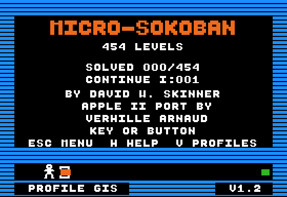
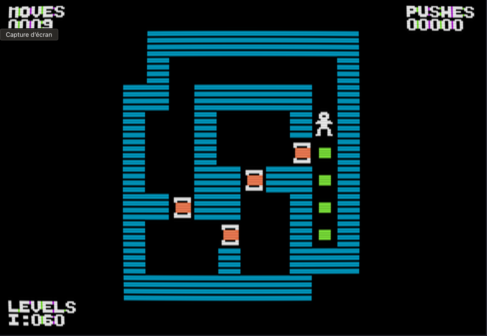
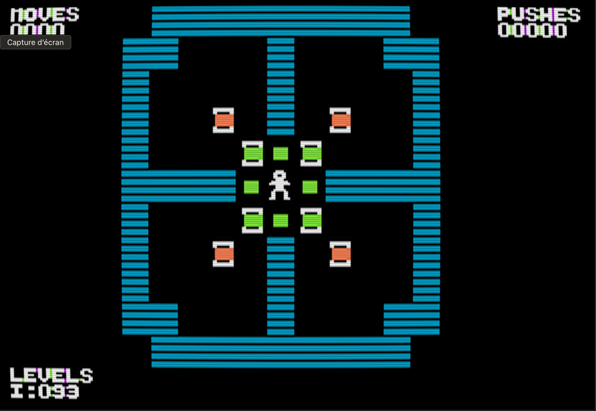
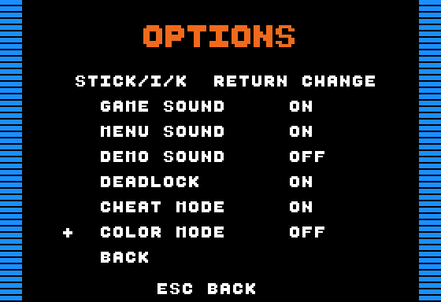
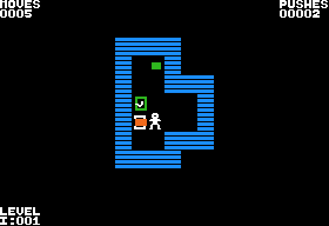

# MICRO-SOKOBAN — Apple II+ / DOS 3.3

Version 1.3, in preparation. Latest release: **1.2** — [disk image and release
notes](https://github.com/habib256/pom2games/releases/tag/1.2)
([notes in this repository](../docs/releases/1.2.md)).

A Sokoban for the **Apple II+ with 48 KB** (and every later Apple II), in HGR,
on a bootable DOS 3.3 5¼" disk. A five-lesson tutorial, then **454 Microban
puzzles** by David W. Skinner — every level of Microban I to IV that fits the
screen without scrolling, turned on its side when needed: 150 of 155, 122 of
135, 92 of 101 and 90 of 102 (see [`levels/README.md`](levels/README.md)).
Ten player profiles, saved positions and records, a Hall of Fame, undo/redo,
joystick or keyboard, a two-voice title tune on the one-bit speaker.

It is the Apple II port of the `sketchs/gen2/game_sokoban` sketch
(HGR_Sokoban, VERHILLE Arnaud) from [POM1](https://github.com/habib256/pom1).

    make            # -> ../dist/MICRO-SOKOBAN.dsk  (bootable DOS 3.3 image)
    make run        # boot it in POM2 (Apple ][+ profile)
    make test       # play every solution and check the game in a2run

## Screenshots

| Microban I, level 30 | Microban I, level 39 |
|:--:|:--:|
|  |  |

| OPTIONS, with COLOR MODE | A crate on its goal in COLOR MODE |
|:--:|:--:|
|  |  |

## Features

- **454 Microban levels** (I to IV) with their original numbers, plus five
  original tutorial lessons. Levels too tall for the screen are turned a
  quarter turn clockwise rather than dropped.
- **Ten independent profiles**, each with its own records, saved position and
  tutorial status; create and rename them from the game.
- **Resume anywhere**: the position is saved to disk when you open the menu
  and after about six seconds without input; after a reboot PLAY brings back
  crates, player, moves and pushes.
- **Undo / Redo** over the last 1024 moves, including an undoable RESTART,
  on the keyboard or the joystick.
- **Hall of Fame** ranked by levels solved, then by the smallest total of best
  moves, saved automatically after each solved level.
- **Joystick or keyboard** (I J K L, W A S D, arrows); the game port is ignored
  when no joystick is plugged in.
- **Sounds and music**: step, goal, deadlock and victory sounds, an optional
  DEADLOCK warning, and a ten-bar two-voice jazz tune on the title screen,
  all on the built-in speaker.
- **Readable in colour and in monochrome**: the seven tiles have distinct
  shapes; COLOR MODE restores filled green crates on colour displays.
- **CHEAT MODE** adds a SOLUTION entry that plays the checked solution of the
  current level without recording anything.
- **Robust saves**: damaged, missing or inconsistent save files are repaired
  or treated as empty; the game keeps running on a write-protected disk.
- **Fast disk I/O**: LZ-packed program, direct RWTS sector reads with a cached
  file map, writes limited to the changed sectors. The title screen is ready
  in about 14 s instead of 20 s.

## How to play

### Controls

| Joystick                              | Keyboard                          | Action                                          |
|---------------------------------------|-----------------------------------|-------------------------------------------------|
| stick (auto-repeat)                   | I J K L, W A S D, arrows          | move / push                                     |
| button 0 (tapped)                     | U                                 | undo one move                                   |
| button 0 held + stick left / right    | U / Y                             | undo / redo (continuous)                        |
|                                       | R                                 | restart the level (undoable: Y replays)         |
|                                       | N / P (in play)                   | next / previous level                           |
| button 1                              | ESC                               | save the position and open the menu             |
| stick up/down + button                | I/K + RETURN or SPACE             | choose in the menu                              |
|                                       | G (or menu)                       | choose a level (grid)                           |
|                                       | V (title or menu)                 | choose, create or rename a profile              |
|                                       | H (title, play or menu)           | HELP                                            |
|                                       | F (menu)                          | Hall of Fame                                    |
|                                       | T (menu)                          | the five-level tutorial                         |
|                                       | O (menu)                          | options: sounds, dead squares, cheat, colour    |
|                                       | C (menu)                          | toggle the DEADLOCK warning                     |
|                                       | Q (menu)                          | quit to DOS                                     |

After a joystick rewind, the stick only moves the player again once it has
returned to the centre: releasing button 0 first plays no move and keeps the
moves to redo. Without a joystick the game port is ignored (axes and buttons):
you play on the keyboard.

The move and push counters stop at 65535. The history keeps the last 1024
moves; beyond that, R reloads the level instead of rewinding it.

### Title screen

The title screen shows the solved levels and the resume level of the active
profile. Its name appears bottom left on the lower wall; the version
(**V1.3**) bottom right. Both white texts sit on a black background with a
margin that avoids colour fringes. The animated corridor spans the whole
width, one step every **~1.6 s**. After at least 15 s without input, the game
waits for the crate to reach its goal, so the animation ends after about
26 s; the **Hall of Fame is then shown for 10 s**, followed by the demo. A key
or a button interrupts the automatic ranking or the demo. The seven demo
levels are Microban 1, 3, 12, 23, 60, 84 and 98; nothing is saved during this
presentation, which is silent by default.

The title screen also shows the credit "APPLE II PORT BY" / "VERHILLE ARNAUD"
on two centred white lines. From the title you can open HELP, PROFILES, the
level grid and the other pages, then come back without starting a game.

### Menu and help

**MENU** (ESC or button 1) offers PLAY / RESUME, TUTORIAL (5), PROFILES,
RESTART, GO TO LEVEL, OPTIONS, HALL OF FAME, HELP and QUIT TO DOS. GO TO
LEVEL replaces NEXT/PREV in the menu. ESC or button 1 goes back; RETURN or
button 0 selects.

If CHEAT MODE is on, a last line, **SOLUTION**, plays the solution of the
current level without recording it: the position from before the menu is
restored, with its Undo/Redo history, including on a write-protected disk.

**HELP** explains the goal, the moves, Undo/Redo and the way back to the
menu. H opens HELP directly from the title or during play; leaving HELP
returns to the menu.

**QUIT TO DOS** and Ctrl-RESET restore the zero page and reload the BASIC
program `HELLO`: `LIST` shows the launcher and `RUN` starts the game again.

### Tutorial

On the first game of each profile, the game offers **five very simple
lessons**, with solutions of 2, 2, 5, 5 and 7 moves. Instructions and
controls are displayed; the tutorial does not count in the ranking. Its
completion is saved per profile. T in the menu replays it; G goes straight to
Microban. Replayed during a game, the tutorial then gives back the level you
left, with its position and counters (the Undo/Redo history starts empty). A
profile created from the menu of a game also begins with the lessons.

### Playing a level

The HUD occupies the four corners (3 cells each, 4 bottom left): moves top
left (`MOVES`), pushes top right (`PUSHES`), level bottom left (`LEVEL`, as
collection and original number: `I:067` is the 67th level of Microban,
`III:056` the 56th of Microban III), and the record bottom right once the
level is solved (`B:0033`).

Crates off their goal are filled orange; crates on a goal have a hollow
green frame and a white check mark. Their shapes also tell them apart in
monochrome, where orange and green have the same shade. With COLOR MODE
(OPTIONS) they are filled green instead. Walls are blue, goals green, the
player white with a green line under the feet when standing on a goal.

**Readability: every normal-size text is white. Only the ×2 enlarged titles
may be coloured**, following the [`lib/hgr`](../dev/lib/hgr/README.md) rule.
Compact text uses an 8-pixel spacing.

On **SUCCESS**, the screen shows an orange ×2 title, the aligned moves and
pushes, the new record (or the best move count) and the number of solved
levels, in white. A key or a button moves to the next level. A key typed
ahead, or still repeating (a //e keyboard), is ignored on this screen as on
BRAVO and HELP: the keyboard must first stay quiet for a quarter of a second.
A button counts at once.

In the level grid (G), solved levels are underlined in green; after the last
level of a collection, a screen (BRAVO) sums it up.

Sounds during play: a click per step, a high beep when a crate reaches a
goal, two low notes when a crate lands on a dead square (with DEADLOCK on in
OPTIONS: a square from which no sequence of pushes can bring it to a goal,
computed when the level loads), a dull thud for an impossible move, a fanfare
at the end of the level.

### Profiles

**PROFILES** (V) chooses among ten independent profiles. The initial profile
GIS can be renamed. N creates a profile in a free slot and activates it; R
renames the selected profile without changing the active one: the game in
progress and its history stay. The mark to the right of a name identifies the
active profile. Initials are prefilled (the selected name when renaming, the
last initials when creating), then editable from the keyboard or the
joystick. RETURN/B0 validates, ESC/B1 cancels; two profiles cannot share a
name. Switching profile reloads its records and saved position, or its first
unsolved level when there is no position. Selecting the already active
profile keeps the game and its history, with no disk read.

### Records and Hall of Fame

After each solved level, the records and the ranking are **saved
automatically under the active profile**, with no initials to type. Records
(moves, then pushes) live on the disk in the active profile's file. At
startup the game resumes the saved position or, failing that, the first
unsolved level.

The ranking favours **the number of levels solved**, then **the smallest
total of moves over the best results** as a tie-break. There are no
artificial points. Totals are recomputed from the records; an improvement
lowers the move total. This tie-break depends on which levels were played: it
is not a comparison against a common optimal solution.

The **Hall of Fame** (F in the menu) shows one line per profile: initials,
eight-digit move total and solved levels, including profiles with no level
finished. Lines and headings are white; only the large title blinks slowly,
changing colour. RETURN, ESC or a button returns to the menu.

### Saving and resuming

The position is saved when the menu or HELP opens, and after about six
seconds without input when it has changed. After a restart, PLAY finds the
crates, the player, the moves and the pushes again. Wait for the end of
"SAVING" before switching off (a sector cut in mid-write becomes unreadable:
the profile then starts over without records); opening the menu triggers
that save at once. The tutorial and the demo do not replace the Microban
position. **The Undo/Redo history stays in memory only**: it starts empty
after a reboot, a profile change or a replayed tutorial.

On a write-protected disk you play without saving: records and position stay
in memory until power-off or a profile change.

### Options

**OPTIONS** (O in the menu) groups six independent switches: game sound,
menu sound, demo sound, DEADLOCK, CHEAT MODE and COLOR MODE. By default the
game, the menu and DEADLOCK are on; the demo, cheat and colour mode are off.
Up/down selects a setting; RETURN or button 0 toggles ON/OFF; ESC or button
1 goes back. The settings are saved on the disk.

- **DEADLOCK** sounds an alert when a crate is pushed onto a square from
  which it can no longer reach any goal. It does not block the move; C
  toggles it from the menu.
- **CHEAT MODE** makes SOLUTION appear in the menu. The 454 solutions are in
  `MICROSOL` (reader, index, then packed moves), and so are the five lessons.
- **COLOR MODE** gives crates on goals their filled green body back, in the
  same white frame as the orange crates. On a monochrome screen orange and
  green have the same shade and the two tiles would be indistinguishable,
  hence the switch, off by default (hollow green frame and white check mark).
- **MENU SOUND** also enables the title music (below). **DEMO SOUND** gives
  the demo its sounds.

### Title music

MENU SOUND enables a calm tune on the title page, on the Apple II's built-in
speaker, without Mockingboard: **two voices**, a melody over a bass walking
on the quarter notes. Ten bars of zen jazz in F, swung at about 100 BPM, so
24 s before it loops: the Gm9 / C13 / Fmaj9 arpeggios of the first version,
then Dm7, Gm9 / C13 again, a detour through Am7 and Dm7, the cadence, a
breath, and the bass alone leads back to the start. The music stops when you
leave the title screen; a key or a button cuts the current note in under
10 ms.

How it works is in [Two voices on a one-bit speaker](#two-voices-on-a-one-bit-speaker).

## Build and run

Prerequisites: cc65 (`brew install cc65`) and python3. The Makefile includes
[`../dev/cc65/apple2.mk`](../dev/cc65/apple2.mk), which carries the tool
variables, library paths and the shared rules.

    make            # ../dist/MICRO-SOKOBAN.dsk, a bootable 5.25" DOS 3.3 image
    make run        # boot the image in POM2 (Apple ][+ profile)
    make test       # the nine test scripts, then every solution (below)
    make clean      # remove build/ (the disk stays)
    make distclean  # remove build/ and the disk

`make run` starts the installed POM2 (`/Applications/POM2.app`, or
`make run POM2=path/to/POM2`).

The image is written by `tools/build_disk.py` on top of `../dev/tools/dos33.py`,
which takes the DOS 3.3 system tracks (tracks 0–2) from
`../dev/tools/dos33_system.bin`. `tools/micro_sokoban_levels.py` converts the
XSB collections into level packs and ca65 tables (`build/lv`), builds the
demo from the checked solutions, and writes the empty save and ranking files.
`tools/hud_font.py` generates `src/bbfont_subset.inc`, the 45-glyph HUD font,
from the shared Beautiful Boot master in [`../dev/lib/font`](../dev/lib/font/README.md).
`tools/pack_program.py` LZ-packs the linked binary into `MICRODATA`,
decoding it again independently before writing.

## Tests

`make test` builds the disk, then runs nine scripts in `a2run` (the headless
emulator in `../dev/tools`) and finally plays the solution of all 454 levels.
Each script boots the real disk image, drives the game with keys and joystick
events, and reads the game's memory through the ld65 labels
(`build/micro_sokoban.lbl`) via the shared harness `../dev/tools/a2test.py`.

| Script | What it checks |
|---|---|
| `tools/test_exit.py` | Boot, QUIT TO DOS and Ctrl-RESET: `HELLO` and the zero page restored, `LIST` then `RUN` relaunch the game, repeatedly (in a2run and in a2shot/POM2). |
| `tools/test_graphics.py` | The HGR page actually displayed versus the hidden drawing page, monochrome silhouettes, and the screen round trips of menus and solution playback. |
| `tools/test_menu_render.py` | The option texts render whole, including a string whose address ends in `$FF`. |
| `tools/test_resume.py` | Resume after reboot, profile isolation, position CRC and corrupted saves, write-protected disks, and writes limited to the changed sectors. |
| `tools/test_play.py` | A game left and found again: tutorial replayed from the menu, SOLUTION, profiles, joystick shuttle, "SAVING", counters capped at 65535, typed-ahead keys. |
| `tools/test_damage.py` | Damaged, missing or inconsistent records files and ranking (impossible length, renamed file, short file, bad ranking): the game starts, repairs what it can, and "IO ERR" on a failed write. |
| `tools/test_tutorial_options.py` | The five lessons (their solutions are replayed by the solver first), Undo/Redo, the return to the title, and the persistent options. |
| `tools/test_score.py` | Profiles, scoring, initials, ranking, HOF1/HOF2 migration and disk persistence. |
| `tools/test_levels.py` | Plays the checked solution of every kept level in the real game (`--all`, for each of the four collections) and checks the game moved on to the next level with the solution's move count. |

Across the suite this also covers corrupted saves, migrations, write-protected
disks and rankings or options that, unchanged, write nothing.

`tools/bench_disk.py` measures the disk timings in POM2 (see
[Disk timings](#disk-timings)); build `dev/tools/a2shot` first. `--disk`,
`--labels` and `--legacy` let you measure an older build.

The supporting tools: `tools/solver.py` (A* over pushes, dead squares and
freeze deadlocks; the same dead-square rule as the game) and
`tools/make_solutions.py` (one checked solution per level into
`levels/solutions.txt`; the 33 levels the solver cannot crack came from YASS,
see [`levels/README.md`](levels/README.md)). `tools/micro_sokoban_levels.py`
exposes `KEYS`, `read_solutions` and `solution_keys`, shared by the tests to
turn a solution into keystrokes.

## Under the hood

### Boot: a BASIC launcher and an LZ-packed program

The BASIC program `HELLO` prints **LOADING MICRO-SOKOBAN**, reserves a single
DOS buffer with `MAXFILES 1` (HIMEM `$9AA6`), then BRUNs the small loader
`MICRO-SOKOBAN` (`src/unpack.s`, at `$0800`). The loader reads `MICRODATA` by
sectors with RWTS and decompresses the game to `$6000`. Its read-only sector
map is patched into it when the image is built: the loader and `MICRODATA`
form a pair and must not be moved separately. The packer
(`tools/pack_program.py`) emits literal runs of up to 127 bytes and matches of
4 to 130 bytes with a 16-bit distance, and decodes its own output again
before writing it.

### Disk I/O: RWTS, direct sectors and a cached file map

During the game, disk access goes through the RWTS routines of DOS 3.3
(`src/fast_disk.inc`). The location of each file is discovered in the catalog
once and cached (metadata only). Sectors are read directly into the hidden
HGR page, then copied into the game's buffers; the displayed screen is never
touched. A position save rewrites only its sector; a record rewrites only the
sectors concerned. The catalog and the VTOC stay intact, and an unchanged
ranking or options cause no write. Old 1830-byte SOK2 files already use the
eight sectors required and can receive the position; the reader refuses to
extend a file beyond its allocated sectors.

The disk layout is specific to this game (`tools/build_disk.py`): DOS order
optimised for the small loader, a physical interleave of two sectors for the
compressed program and of three for the game files, measured with the
resident RWTS loop in POM2. The shared DOS tool keeps its usual behaviour.

### Level packs

`tools/micro_sokoban_levels.py` drops the levels that do not fit in 20 × 12
cells or for which no placement leaves the four HUD corners outside the
walls, and lists them in `build/lv/report.txt`. A level too tall that fits on
its side is turned a quarter turn clockwise (the puzzle and its solution are
the same, rotated; the HUD keeps the original number). The placement closest
to the centre wins. A level is encoded as one-byte runs (3-bit tile type,
5-bit length): 6.6 KB for Microban, 5.8 KB for Microban II, 4.0 KB for III,
5.0 KB for IV, split into thirteen packs of at most 2 KB that are loaded at
`$1000` when play crosses into another pack.

### Save files and their repair

`MICROSAVE` holds profile zero; `MICROSAV1` to `MICROSAV9` the others. The
1830 bytes of SOK2 records stay compatible; a 134-byte position is appended,
so 1964 bytes per file. Bit 7 of byte 4 marks the tutorial as completed. The
position holds the packed board, the player, the counters, the level, its
fingerprint and a CRC-8; an invalid position is ignored. Each file carries a
fingerprint of every collection (kept levels, order, content, rotation): if a
new version of the game changes a collection's levels, its records are erased
rather than attributed to other levels; the other collections' records stay.

`MICROHOF` holds the ranking, the options, the ten names and the active
profile (120 bytes, format `HOF3`). Old HOF2 rankings are rebuilt once from
each profile's records: names, options and active profile are kept. HOF1
still imports the shared records into profile zero. The other profiles
receive no fictitious progress.

At startup, `MICROHOF` is made consistent with its ten profiles, which name
the records files: an active profile that is not a registered one becomes the
first registered; the header initials become those of the active profile; a
ranking row stays only if its initials are a profile's, once (including when
a HOF2 is taken over). Names that are not three letters, two profiles with
the same name or an out-of-range value reset the ranking, the names and the
options to their defaults; the records files are untouched. The corrected
file is rewritten at the first ranking write.

A records file or ranking that cannot be read (damaged sector, impossible
length, missing file) does not stop the game: it counts as empty — a profile
without records, default ranking and options. The ranking is rewritten at
once, the whole records file at the next save. A file shorter than expected
only provides what it holds; the rest is empty. A failed write leaves
"IO ERR" in the status corner and the game goes on; the sectors remain to be
written. Only an unreadable level pack or `MICROSOL` stop the game: "IO ERR",
a key, then back to DOS.

### Memory map and resident budget

The resident (`$6000` to `$9A9F`, below the DOS buffers) is almost full. The
copy of DOS's zero page therefore lives in page 2 (`$0200`, the input buffer,
free as long as no DOS command runs); the ranking and the game's zero page
during RWTS occupy the start of page 3 (`$0300` to `$03B3`, below the DOS
vectors). What is only needed at startup (reading and checking `MICROHOF`,
taking over old rankings) forms the `BOOTCODE` segment: it follows the
resident in the file, so the loader leaves it where the BSS will be, and
`main` moves it down to `$1000` before anything else; the first level pack
then takes its place. About **380 bytes** remain for the resident (the
segment must also fit below `$9AA0` on arrival) and **230** in this
three-page segment: see `build/micro_sokoban.map`.

The level packs are loaded at `$1000`; the active profile's records and
position occupy `$1800` to `$1FAB`, without shrinking the 1024-move Undo
history. The solution reader (`SOLCODE`, 508 bytes) is not resident either:
the first two sectors of `MICROSOL` are copied over the decoded level pack
and run at `$1004`; the moves are read above the reader, so the game's own
history survives.

### HUD font

The HUD and titles use a 45-glyph subset of Michael Pohoreski's Beautiful
Boot font, 360 bytes, generated by `tools/hud_font.py` into
`src/bbfont_subset.inc` from the shared master in
[`../dev/lib/font`](../dev/lib/font/README.md) (via `../dev/tools/fonts.py`).
Strings in the game are glyph indices, not ASCII (`GSTR`), so the resident
only carries the glyphs it prints; the five glyphs `F + - / .` were drawn for
the port in the same 6 px / 2 px-stroke style and live in the generator
(`ORDER` / `EXTRA`). `make` regenerates the include when the master changes.

Compact eight-pixel text and byte-aligned white titles use the native
[`hgr_glyph8.asm`](../dev/lib/hgr/hgr_glyph8.asm) core. Compact text replaces
its cell's pixels while preserving neighbouring strokes; blank glyphs erase
the cell. The coloured doubled font and 14×16 tile loops remain specialized.
Before/after captures of the title, menus, help, options and level selector
have identical displayed pixels. Cycle measurements across seven alignments
show a 3.1% mean reduction for a dense compact glyph, with slower results at
the first two alignments; this is not a speedup for every placement.

### Two voices on a one-bit speaker

The speaker has one bit. `title_duet` (`src/title_music.inc`) mixes two
square waves by time division: on each turn of its loop (33 cycles) it looks
at the bass, then at the melody. While both are at the same level the speaker
rests there; when they differ it flips at both looks and follows the bass for
14 cycles, the melody for 19, at 31 kHz. That carrier is inaudible: what is
left is the sum of the two waves, the melody a little louder. Every path
through a turn takes 33 cycles, so a half-period is a whole number of turns.
The just scale of F gives whole periods (F3 = 90 turns, a third of a semitone
below concert pitch); only B flat falls between two values. The loop is
included at `$6003` so that it never crosses a page boundary. The corridor
animation step waits for the end of the current beat and takes its drawing
time from the rest that follows: the pulse stays regular.

### Differences from the Apple-1 / GEN2 original

- No V-blank on a II+: the tiles are drawn directly (2–3 per move).
- Both paddles are read in a single fixed-duration loop (6 ms), buttons are
  edge-detected, the stick repeats every ~200 ms. A paddle whose timer is
  still running after that loop is not connected: without a joystick neither
  the axes nor the buttons (floating inputs) are read.
- HGR colour tiles (blue walls, orange crates, green placed crates and goals,
  a white player with a green line under the feet on a goal); the Apple-1
  text screen is replaced by the HGR menu.
- `../dev` layout: binary at `$6000` (config `apple2_micro_sokoban.cfg`),
  above both HGR pages, zero page at `$50` saved at startup and restored on
  exit (`dev/lib/apple2/exit.asm`).
- Double buffering: whole screens (level, title, help, success) are drawn on
  the hidden HGR page and shown at once; during play, the 2–3 tiles of a move
  are drawn on the displayed page.
- The levels are no longer in the binary: they are read in packs from the
  disk, with the DOS RWTS routines, cached sector lists and the game's zero
  page preserved during each access.

Planned improvements: see [`TODO.md`](TODO.md).

## Technical reference

### Source tree

    src/micro_sokoban.s        the game (ca65), runs at $6000
    src/unpack.s               small loader at $0800, RWTS reads and decompression
    src/fast_disk.inc          disk access and cached sector lists
    src/resume.inc             position save and resume
    src/beginner.inc           tutorial and options
    src/title_music.inc        two-voice title music (engine and score)
    src/score_hof.inc          records, ranking and initials entry
    src/profiles.inc           profile selection and independent saves
    src/solution.inc           CHEAT MODE solution playback (SOLCODE, run from MICROSOL)
    src/bbfont_subset.inc      HUD font, generated by tools/hud_font.py (Beautiful Boot, 45 glyphs)
    src/hello.bas              prints LOADING MICRO-SOKOBAN, then starts the loader
    apple2_micro_sokoban.cfg   48 KB memory map (work RAM at $0800, buffers in $0200-$03CF, MAXFILES 1)
    tools/pack_program.py      LZ compression, verified by an independent decoder
    tools/build_disk.py        DOS disk and drive-friendly allocation
    tools/hud_font.py          the 45-glyph HUD font from dev/lib/font
    tools/micro_sokoban_levels.py  XSB -> level packs + ca65 tables (build/lv), demo;
                               KEYS / read_solutions / solution_keys shared by the tests
    tools/solver.py            solver (A*, dead squares, freeze); same dead-square rule as the game
    tools/make_solutions.py    one checked solution per level -> levels/solutions.txt
    tools/test_exit.py         startup, QUIT/RESET, restored BASIC and RUN relaunches (a2run/POM2)
    tools/test_graphics.py     visible/hidden HGR pages and menu/solution round trips
    tools/test_menu_render.py  option texts, including an address ending in $FF
    tools/test_resume.py       resume, profiles, CRC and limited writes
    tools/test_play.py         a game left and found again: tutorial, SOLUTION, profiles,
                               joystick, "SAVING", counters, typed-ahead keys
    tools/test_damage.py       damaged, missing or inconsistent records and ranking, "IO ERR"
    tools/test_tutorial_options.py  tutorial, return to title and persistent options
    tools/test_score.py        profiles, ranking, migration and saving
    tools/test_levels.py       plays the solutions in the real game (a2run): make test
    tools/bench_disk.py        measures reads and saves in POM2
    levels/tutorial.xsb        five original introductory levels
    levels/microban.xsb        Microban, David W. Skinner (XSB source, see levels/README.md)
    levels/microban2.xsb       Microban II, idem
    levels/microban3.xsb       Microban III, idem
    levels/microban4.xsb       Microban IV, idem
    levels/solutions.txt       the 454 solutions (demo and tests)
    ../dist/MICRO-SOKOBAN.dsk  the produced image

### Files on the disk

| File | Content |
|---|---|
| `HELLO` | Applesoft launcher: LOADING MICRO-SOKOBAN, `MAXFILES 1`, `BRUN MICRO-SOKOBAN` |
| `MICRO-SOKOBAN` | the loader (`src/unpack.s`, `$0800`), with its sector map of `MICRODATA` |
| `MICRODATA` | the LZ-packed game, decompressed to `$6000` |
| `MB1A` … `MB1D`, `MB2A` … `MB2C`, `MB3A` … `MB3C`, `MB4A` … `MB4C` | thirteen level packs of at most 2 KB, loaded at `$1000` |
| `MICROSAVE`, `MICROSAV1` … `MICROSAV9` | the ten profile files (SOK2 records + position, 1964 bytes) |
| `MICROHOF` | ranking, options, ten names and active profile (HOF3, 120 bytes) |
| `MICROSOL` | the 454 solutions and the five lessons: reader (508 bytes), index, packed moves |

### Memory map (`apple2_micro_sokoban.cfg`)

| Region | Address | Use |
|---|---|---|
| `ZP` | `$0050`–`$00FF` | the game's zero page, saved at startup and restored on exit |
| `PAGE2` | `$0200`–`$02FF` | copy of DOS's zero page (GETLN buffer, free while no DOS command runs) |
| `PAGE3` | `$0300`–`$03CF` | ranking buffer and the game's zero page during RWTS (`$0300`–`$03B3` used); DOS keeps `$03D0`–`$03FF` |
| `WORKRAM` | `$0800`–`$0FFF` | work buffers (the loader's area, disposable after boot) |
| `LOWRAM` | `$1000`–`$1FFF` | level pack (`$1000`, ≤ 2 KB), then the active records and position (`$1800`–`$1FAB`) |
| `BOOT` | `$1000`–`$12FF` | `BOOTCODE`: start-only code, moved here by `main`, overwritten by the first pack |
| `SOL` | `$1004`–`$11FF` | `SOLCODE`: the solution reader, copied from `MICROSOL` over the decoded pack |
| HGR | `$2000`–`$5FFF` | both HGR pages; RWTS stages sectors on the hidden one |
| `MAIN` | `$6000`–`$9A9F` | the resident: code, data, BSS, below the DOS buffers at HIMEM `$9AA6` |

### File formats

- **Level pack**: byte `n`, `n` offset low bytes, `n` offset high bytes (from
  the pack start), then per level `w, h, row, col` and the runs. A run is one
  byte, `tile type << 5 | (length - 1)`, in row-major order over the `w × h`
  box; tile types are 0 floor/outside, 1 wall, 2 goal, 3 crate, 4 crate on
  goal, 5 player, 6 player on goal.
- **Records (SOK2)**: `"SOK2"`, last collection and level solved (bit 7 of
  byte 4: tutorial done), one 16-bit fingerprint per collection, then 4 bytes
  per kept level (best moves, best pushes; 0 = unsolved): 1830 bytes, plus
  the 134-byte position (version, collection, level, fingerprint, player
  row/column, moves, pushes, crates left, CRC-8, 120 packed pairs of tiles).
- **Ranking (HOF3)**: 120 bytes; 8-byte rows of three ASCII initials, the
  move total and the solved count, plus the ten names, the active slot and
  the options byte (COLOR MODE uses a spare bit, so 1.1 disks keep
  working).
- **Solutions (`MICROSOL`)**: DOS header, 508 bytes of reader, 4-byte
  entries (payload offset, move count), then the moves packed four to a byte.
  The longest solution takes 264 bytes; the buffer above the reader is 1.5 KB.

### Levels turned or left out

Turned a quarter turn clockwise: Microban 66, 109, 112, 143; Microban II 55,
86, 87, 91, 93, 100, 102, 104, 110, 119, 121; Microban III 22, 40; Microban
IV 56, 70, 78, 88.

Left out — Microban: 99, 101, 113, 154 and 155; Microban II: 66, 85, 114,
115, 120 (15 × 12 but walls in a HUD corner), 125, 126 and 130 to 135 (from
18 × 17 to 47 × 41); Microban III: 23, 24, 33, 46, 47, 57, 58, 59, 101;
Microban IV: 30, 39, 40, 42, 50, 58, 59, 60, 75, 85, 101, 102. The fourth
cell of the bottom-left corner excludes no further level. The complete list,
with sizes, is in `build/lv/report.txt`.

### Title-screen demo

The demo plays Microban 1, 3, 12, 23, 60, 84 and 98 from the checked
solutions (`DEMO` in the Makefile); the last three have 4, 3 and 5 crates
and much longer solutions than the four introductory ones. The packs are
loaded as needed.

### Disk timings

Measured with `python3 micro-sokoban/tools/bench_disk.py` in POM2's Apple II+
engine:

| Operation | Previous version, rebuilt | Current version |
|---|---:|---:|
| Boot until the title is ready | 20.18 s | 13.98 s |
| First read of a profile | 3.60 s | 2.10 s |
| First read of a level pack | 3.54 s | 2.01 s |
| Records and ranking after a solved level | 7.40 s | 0.54 s |
| Saving a position | none | 0.37 s |

These are cycles of the emulated processor, Disk II rotation and head moves
included, not host computing time. They are not measurements on a physical
machine, and they vary with the file and the head position. Build
`dev/tools/a2shot` before running the benchmark; `--disk`, `--labels` and
`--legacy` measure an older build.

## Credits and licence

- Levels: **Microban I to IV by David W. Skinner**, distributed with credit
  ("These sets may be freely distributed provided they remain properly
  credited"); sources and checksums in [`levels/README.md`](levels/README.md).
  The 33 hardest solutions were found with YASS 2.153 by Brian Damgaard.
- Font: **Beautiful Boot by Michael Pohoreski**, through
  [`../dev/lib/font`](../dev/lib/font/README.md).
- Apple II port, tutorial levels, music and tools: **VERHILLE Arnaud**, from
  the HGR_Sokoban sketch of [POM1](https://github.com/habib256/pom1).
- Licence: [GPL-3.0](../LICENSE), like the upstream sketch.
